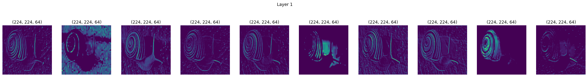
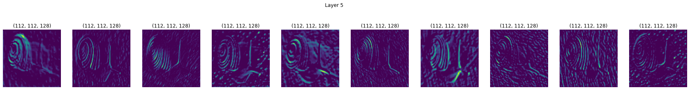
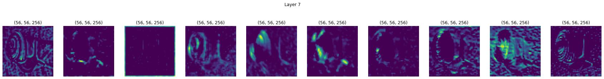
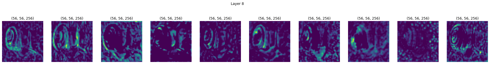

# Inside CNN

How to visualize filters and feature Maps in Convolutional Neural Networks (CNN)

## Example of a `snail` image propagated throw the `VGG` network

### 1st Layer

### 3rd Layer

### 5th Layer

### 7th Layer

### 8th Layer

